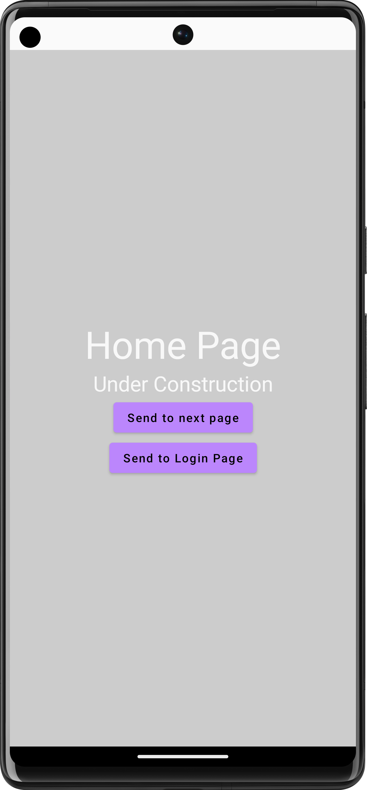
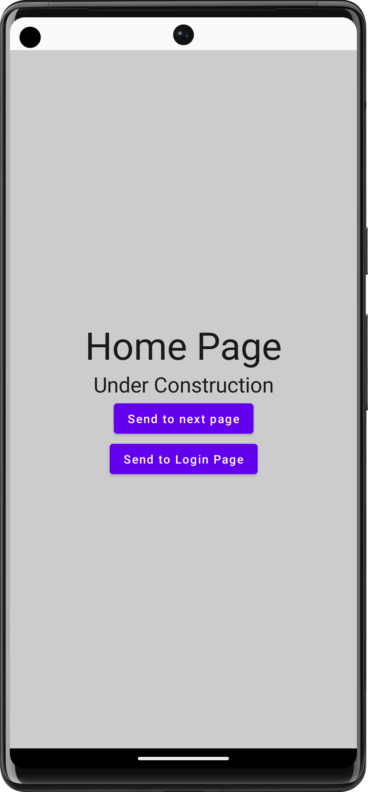
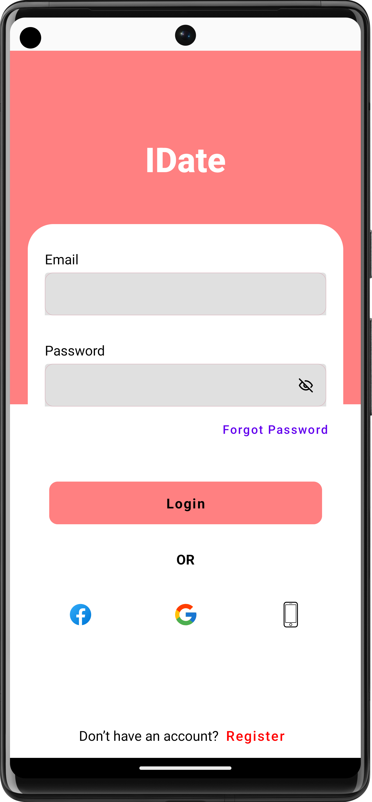

<!-- NOTE: The log might (or not) be changed -->

  

<h1 align = "center">
<b><i>DateMe</i></b>
</h1>

DateMe is a sample dating app that provides that allows users to go through dating partners: cheat, flirt, meeting and potentially becoming romantically involved.

The goal of this project is to practice & demonstrate the use of some Modern Android Development Practices, Material Design Theming & Jetpack Compose.

## 🚧 Project Under Construction 🚧

As of now, this app is being built from the very scratch.
Feel free to checkout the [Figma UI Design](https://www.figma.com/file/PgJFxHHQAnYB5roi11zgUb/DateMe!!---UI?node-id=0%3A1)

- [Static Code Analysis](./docs/StaticCodeAnalysis.md)
- [Versions Plugin](./docs/VersionsPlugin.md)

## 📱 Screenshots 📱

 

Light Mode

 

## 🪶 Author(s) 🪶

Take a look at our cool contributors for this project. 😎

## 📜 License 📜

This project is under the [**GNU General Public License v3.0**](./LICENSE).

Permissions of this strong copyleft license are conditioned on making available complete source code of licensed works and modifications, which include larger works using a licensed work, under the same license.
Copyright and license notices must be preserved. Contributors provide an express grant of patent rights.
